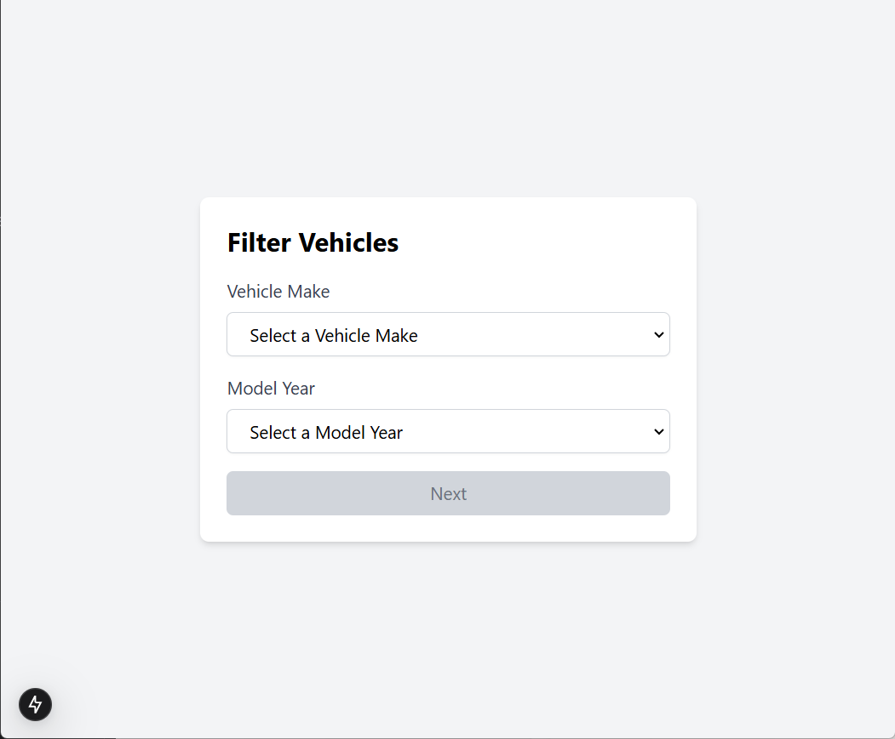
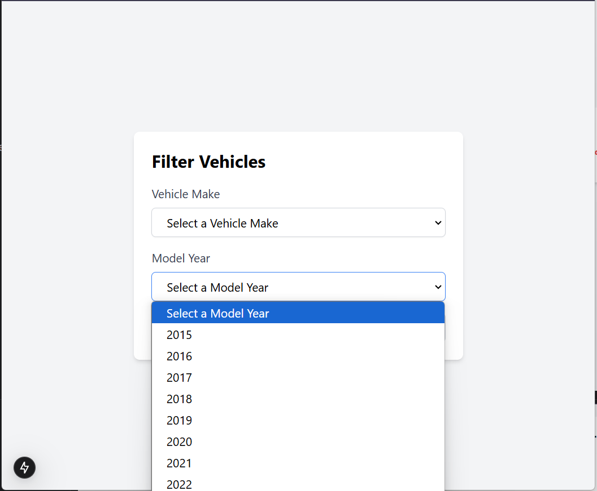
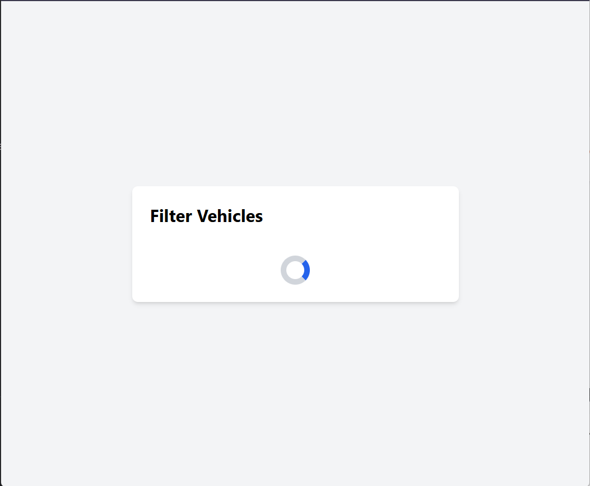
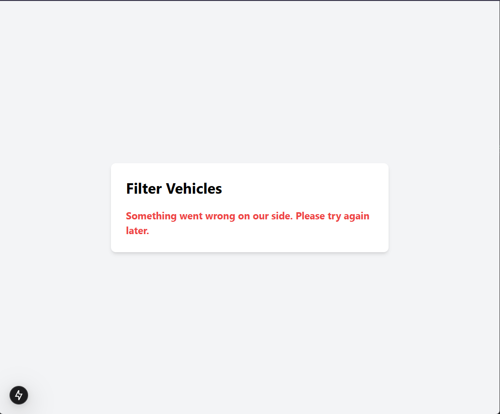
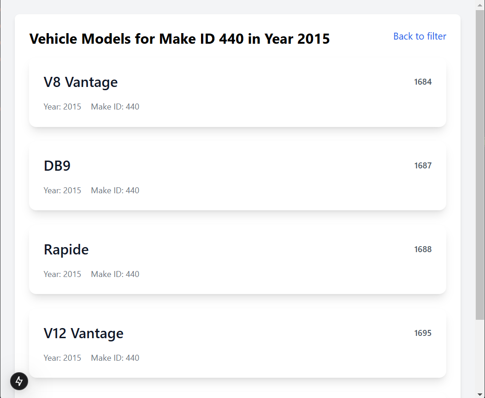
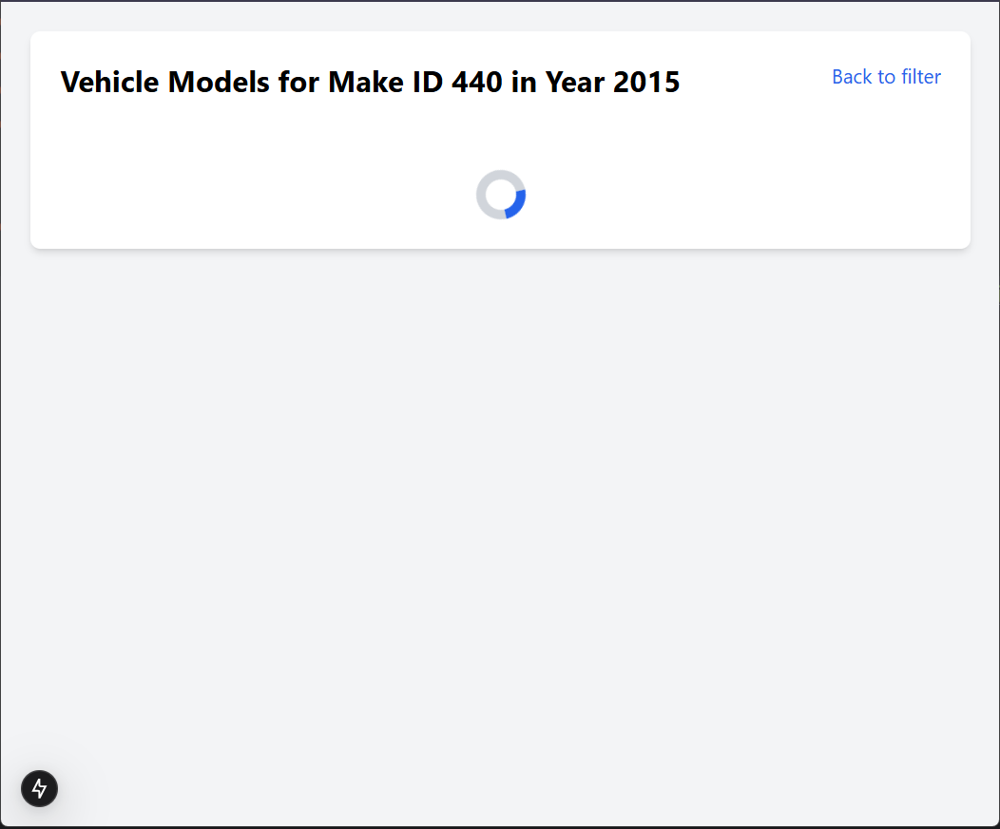
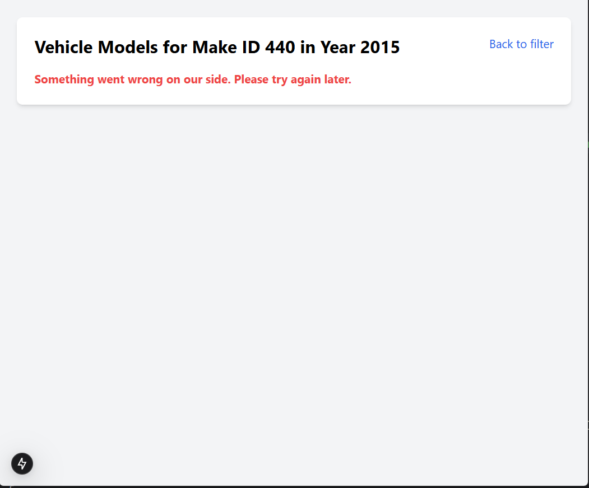

# Car dealer

## Overview

This is a car dealer application designed to allow users to filter vehicles by type and model year. The application
fetches data from the NHTSA API and displays vehicle models based on selected make and model year. The app consists of
two main pages: the Filter Page where users select vehicle type and model year, and the Result Page that displays the
list of vehicle models matching the selected criteria.

## Features

- **Filter Page**: page to select a vehicle make and model year. The user can choose a make from a dropdown populated
  with vehicle make data and a model year from a range between 2015 and the current year. The "Next" button is enabled
  only after both parameters are selected, and it navigates to the results page to display the vehicle models. .
- **Result Page**: Result Page: Displays vehicle models based on the selected make and model year. The page fetches
  vehicle data using the selected parameters and shows the results. It includes error handling for data fetching issues
  and is pre-rendered using generateStaticParams for optimal performance.

## Technologies Used

- **React** for building the user interface
- **Next.js** for server-side rendering and static site generation
- **SWR** for data fetching with caching
- **TypeScript** for static type checking
- **Tailwind CSS** for utility-first CSS styling
- **Nanoid** for generating unique identifiers

## Installation and Setup

### Prerequisites

- **Node.js** (version 14 or higher)
- **npm**

### Setup

1. Clone the repository:
   ```bash
   git clone https://github.com/yourusername/car-dealer.git
2. Install dependencies:
   ```bash
   npm install
3. Run Project:
   ```bash
   npm run start
4. Build Project:
    ```bash
   npm run build

## Screenshots

| Name                         | Screen                                                                     |
|------------------------------|----------------------------------------------------------------------------|
| Filter page                  |                            |
| Filter page choose an option |  |
| Filter page loading          |            |
| Filter page error            |                |
| Result filter page           |              |
| Result filter page loading   |     |
| Result filter page error     |         |